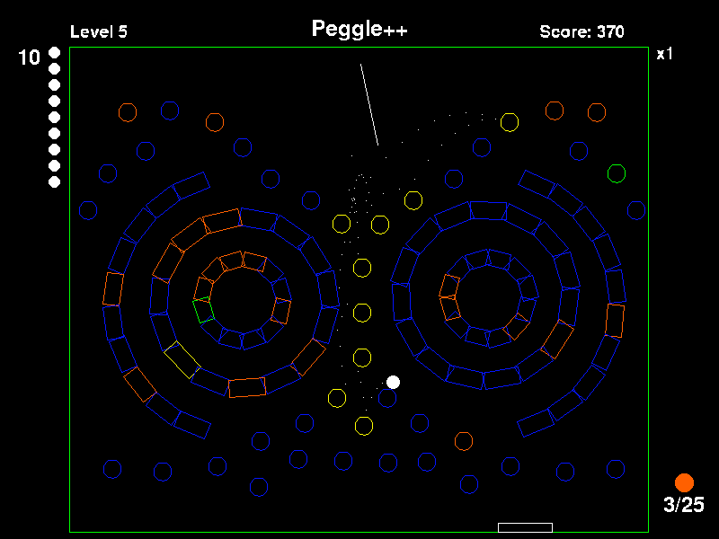
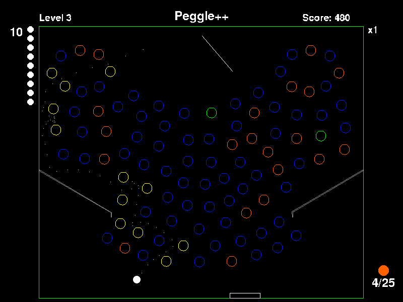

# Peggle
Versión del juego Peggle en SDL2 y C++ 

## Requerimientos
Para compilar se necesita instalar CMake y SDL2
```bash
sudo apt-get install cmake
sudo apt-get install libsdl2-dev libsdl2-ttf-dev
```

## Compilar
Para compilar manualmente dar los permisos necesarios a build.sh
```bash
chmod +x ./build.sh
```

## Instalación
```bash
git clone https://github.com/aromero3003/peggle.git
cd peggle
chmod +x build.sh
./build.sh
```

## Jugar
Ejecutar como `./Peggle`. Las ubicaciones están hardcodeadas y son relativas.
Por lo que al cambiar el ejecutable de ubicación no iniciará el juego.

Para debugging la tecla `q` cambia al siguiente nivel y `e` cambia a Nivel Fallido.




